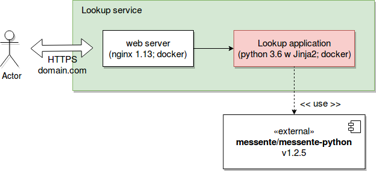

# Phone Number Lookup 

Web application for looking up phone number operators. 
Using API provided by [Messente](https://messente.com).

Test environment can be found [here](http://104.214.219.4:8555).

### Scope of the application

Simple web application where user has the ability to look up if a 
phone number exists (is valid) and the name of the operator. 

Without any limitations the scope can grow quite large. I reduced the size of the scope by these limitations:

- User can only search for 1 number at a time. This can be easily changed
by making a few changes in the front-end (the backend logic already supports it). 
Mostly it's a UX question. 
- There is no production build. Only development configuration.
- Official messente-python library is missing a HLR endpoint support. I created the integration for it, but it needs some work
before it can be merged in the library. I included some unit tests, but not enough to cover everything.
- There is no error handling in the API if Messente should have API errors. 
- Backend is written in Python 3. The application itself doesn't have tests. Only the Messente integration. 
Mostly because there's very little to test. 
- Front-end is written with Javascript (jquery) with webpack and ES6 compatibility. There are no tests in front end. 
- No application logging (didn't have time)
- Poor error handling (didn't have time)

### Architecture

## Steps to run the application in development

The application is 100% built on docker containers. Dev/test/staging and live environments are all run in docker containers.
This will make development environment setups easy and team can be sure that all developers run with the same environment.

**To run the project in development**

**1. Clone the project**
`git clone git@github.com:MarkoSulamagi/PhoneNumberLookup.git`

**2. Install docker**
This is the environment specific part. Installing docker on Linux OSs is usually quite easy. 
I've noticed some installation issues with the Windows and Mac environments, but nothing that quick googling can't fix. 

https://docs.docker.com/install/

On Ubuntu 16.04 https://www.digitalocean.com/community/tutorials/how-to-install-and-use-docker-on-ubuntu-16-04

**3. Install docker-compose**
https://docs.docker.com/compose/

On Ubuntu 16.04 https://www.digitalocean.com/community/tutorials/how-to-install-docker-compose-on-ubuntu-16-04

**4. Build application**

`docker-compose build`

Docker needs to download all the dependencies, so it could take a while.

**5. Add configuraiton**

Rename .env.example into .env.

`cp .env.example .env`

Open .env files and replace the sample configuration with your own. Messente API username and password are required. 
You can sign up to [Messente]('https://messente.com').

**6. Run application**

`docker-compose up`

Docker needs to download all the dependencies, so it could take a while. 
Depending on the speed of the internet. Downloads only happen on first run. 

**8. Visit http://localhost:8555**

## Some development helpers. Only useful for additional development 

**Run Messente HLR API integration tests**

`docker exec -it numberlookup_app python -m unittest services.messente_api_tests`

**Install new JS library**

`docker exec -it numberlookup_npm npm install --save redux`
